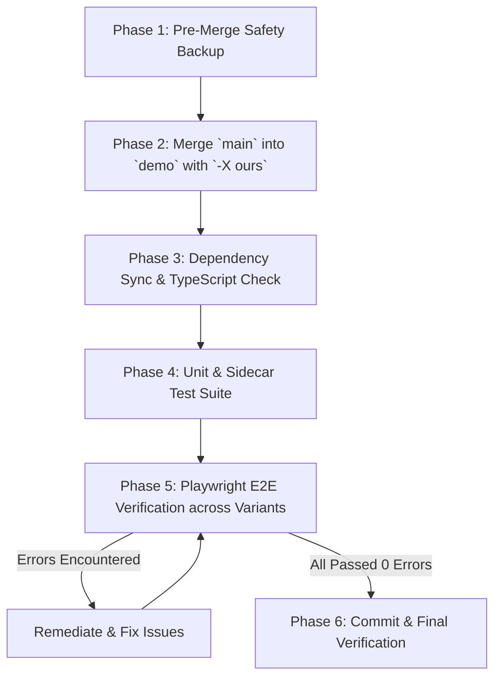

# Plan: Merge Upstream `main` into `demo` with Modification Retention & E2E Validation

## Objective
Merge all incoming updates from branch `main` (upstream v2.10.0+) into branch `demo`, ensuring all existing `demo` implementations and custom enhancements are strictly preserved during conflict resolution ("ours" strategy), followed by comprehensive end-to-end verification until zero errors remain across all variants.

---

## High-Level Architecture & Strategy



---

## Phase Breakdown

### Phase 1: Safety & Branch Backup
- **Goal**: Create an immutable backup point of `demo` prior to merge operations.
- **Actions**:
  1. Ensure working directory on branch `demo` is clean.
  2. Create a local backup reference tag/branch: `demo-pre-merge-backup`.

### Phase 2: Merge Execution & Conflict Strategy
- **Goal**: Ingest all non-conflicting new files/features from `main` while retaining `demo` implementations for all overlapping files.
- **Actions**:
  1. Ensure `demo` is checked out and up to date.
  2. Initiate merge:
     ```bash
     git merge main -s ort -X ours -m "merge: sync latest changes from main branch into demo (retaining demo modifications)"
     ```
  3. Inspect any unresolved conflicts (e.g., deleted vs modified files) and resolve in favor of `demo` (`git checkout --ours <path>` / `git add`).
  4. Verify working tree status after merge completion.

### Phase 3: Dependency Sync & Build Verification
- **Goal**: Reconcile `package.json` / `package-lock.json`, ensure dependencies install cleanly, and verify TypeScript compilation.
- **Actions**:
  1. Run `npm install` to update packages if new dependencies were introduced by `main`.
  2. Run TypeScript typecheck:
     ```bash
     npm run typecheck
     ```
  3. Verify frontend builds across all variants:
     - `npm run build:full`
     - `npm run build:tech`
     - `npm run build:finance`

### Phase 4: Unit, Data, and Sidecar Test Suite
- **Goal**: Ensure core node tests, data parsers, and sidecar API routes pass without regression.
- **Actions**:
  1. Run data tests:
     ```bash
     npm run test:data
     ```
  2. Run sidecar & local API tests:
     ```bash
     npm run test:sidecar
     ```

### Phase 5: Playwright E2E Suite Execution & Remediation Loop
- **Goal**: Execute all end-to-end tests across runtime and all dashboard variants until 100% pass rate.
- **Actions**:
  1. **Runtime Fetch Tests**:
     ```bash
     npm run test:e2e:runtime
     ```
  2. **Full Variant E2E**:
     ```bash
     npm run test:e2e:full
     ```
  3. **Tech Variant E2E**:
     ```bash
     npm run test:e2e:tech
     ```
  4. **Finance Variant E2E**:
     ```bash
     npm run test:e2e:finance
     ```
  5. **Combined E2E Verification**:
     ```bash
     npm run test:e2e
     ```
  6. **Iterative Remediation**: In case of any failing E2E assertions, trace issues, apply targeted fixes, and re-run until completely error-free.

### Phase 6: Finalization & Commit
- **Goal**: Verify clean git status and provide execution summary.
- **Actions**:
  1. Run `git status` to verify working tree is clean and all commits are properly recorded.
  2. Summarize merge statistics, files changed, and test outcomes.

---

## Acceptance Criteria
- [ ] Branch `demo` contains all non-conflicting additions and updates from `main`.
- [ ] All pre-existing `demo` customizations and fixes are preserved.
- [ ] `npm run typecheck` passes with zero errors.
- [ ] `npm run test:data` and `npm run test:sidecar` pass with zero errors.
- [ ] All builds (`build:full`, `build:tech`, `build:finance`) succeed.
- [ ] Full Playwright E2E suite (`npm run test:e2e`) runs and passes completely with zero errors.
